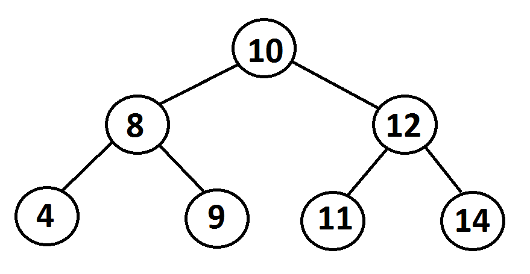

This is the 4. post of my "Data Structures & Algorithms Collection" blog series. This blog deals with a hard graph problem.

===

Binary Search Tree Sequences: A binary search tree was crated by traversing through an array from left to right and inserting each element. Given a binary search tree with distinct elements, determine all possible arrays that could have led to this tree.

Suppose we have this graph:



There is actually one element that must have been inserted first: The root node (10).
Next, either the left child (8) or right child (12) could have been inserted. Notice that there the insertion order does not depend on whether a node appears on the left or right side. For example 10 could be inserted first, then 8, 9 and 12 etc.

If we start at the root and we have all possible combinations of the left and right child, we could just "weave" them together.
For example, when we weave {8, 4, 9} and {12, 11} elements, part of the combinations is:
[{8, 4, 9, 12, 11},{8, 9, 4, 12, 11},{8, 12, 9, 4, 11}{8, 12, 11, 9, 4},{8, 12, 11, 4, 9},{12, 11, 8, 4, 9},... ]

We can split the algorithm into 2 recursive functions: one for weaving elements and one for traversing the tree downwards.

Here's the source code:

```
func BSTSequences(root: SimpleTreeNode<T>?) -> [[SimpleTreeNode<T>]] {
        guard let root = root else {
            return []
        }
        
        let leftSequences = BSTSequences(root: root.left)
        let rightSequences = BSTSequences(root: root.right)
        
        if leftSequences.isEmpty, rightSequences.isEmpty {
            return [[root]]
        } else if leftSequences.isEmpty {
            return rightSequences
        } else if rightSequences.isEmpty {
            return leftSequences
        }
        
        var sequences: [[SimpleTreeNode<T>]] = []
        
        leftSequences.forEach { left in
            rightSequences.forEach { right in
                sequences.append(contentsOf: weave(left: left, right: right, prefix: [root]))
            }
        }
        
        return sequences
    }
    
    private func weave(left: [SimpleTreeNode<T>], right: [SimpleTreeNode<T>], prefix: [SimpleTreeNode<T>]) -> [[SimpleTreeNode<T>]] {
        var newPrefix = prefix
        
        if left.isEmpty {
            newPrefix.append(contentsOf: right)
            return [newPrefix]
        } else if right.isEmpty {
            newPrefix.append(contentsOf: left)
            return [newPrefix]
        }
        
        newPrefix.append(left[0])
        var result = weave(left: Array(left[1..<left.count]), right: right, prefix: newPrefix)
        
        newPrefix = prefix
        newPrefix.append(right[0])
        let rightFirstWeaves = weave(left: left, right: Array(right[1..<right.count]), prefix: newPrefix)
        
        result.append(contentsOf: rightFirstWeaves)
        
        return result
    }
```

You can also check it out in my repository:

[BSTSequence](https://github.com/sjaindl/DataStructuresAlgs/blob/master/Sources/DataStructuresAlgorithms/SpecificAlgorithms/GraphsAndTrees/BSTSequence.swift)
