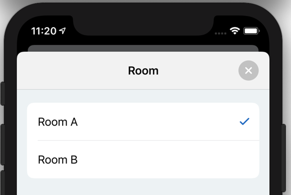

This article is part 5 of my UIKit Cheatsheet series. It deals with different presentation modes for ViewControllers.

===

Every iOS app needs to use presentation modes. I will deal here with modal and primary context presentation (there is also e.g. showDetail presentation).

**Navigation (show)**

This modes presents a view controller in a primary context. The viewController needs to be embedded in a UINavigationController (if not already) and be shown:

```
let navigation = UINavigationController(rootViewController: calendarController)
show(navi, sender: self)
```


**Modal Presentation (present)**

This presents a viewController in a modal presentation style:

`present(calendarController, animated: true)`



Modal presentation is also possible with a navigation bar:


In order to do so, the ViewController needs to embedded into a navigation controller:

```
func embedInNavigationController(navBarClass: AnyClass?, toolBarClass: AnyClass?) -> DestinationNavigationController {¬
        let nav = UINavigationController(navigationBarClass: navBarClass, toolbarClass: toolBarClass)
        nav.viewControllers = [self]
        return nav
}
```

The dismiss method closes a modally presented ViewController:
`viewController?.dismiss(animated: true, completion: nil)`


A useful property is the presentingController, which is available on modally presented view controllers. It represents the view controller that presented this view controller.

There are many different presentation styles for modal presentations offered by UIKit (cases from Apple documentation):

<blockquote>
<b>case automatic</b>: The default presentation style chosen by the system.<br>
<b>case none</b>: A presentation style that indicates no adaptations should be made.<br>
<b>case fullScreen</b>: A presentation style in which the presented view covers the screen.<br>
<b>case pageSheet</b>: A presentation style that partially covers the underlying content.<br>
<b>case formSheet</b>: A presentation style that displays the content centered in the screen.<br>
<b>case currentContext</b>: A presentation style where the content is displayed over another view controller’s content.<br>
<b>case custom</b>: A custom view presentation style that is managed by a custom presentation controller and one or more custom animator objects.<br>
<b>case overFullScreen</b>: A view presentation style in which the presented view covers the screen.<br>
<b>case overCurrentContext</b>: A presentation style where the content is displayed over another view controller’s content.<br>
<b>case popover</b>: A presentation style where the content is displayed in a popover view.<br>
<b>case blurOverFullScreen</b>: A presentation style that blurs the underlying content before displaying new content in a full-screen presentation.<br>
</blockquote>
    
Most often used properties (at least by me) are fullScreen, pageSheet and overCurrentContext.