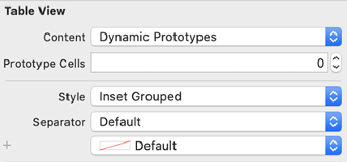

This article is part 2 of my  UIKit Cheatsheet series. It deals with tricks for UITableView.

===

To prevent a tableView to show an empty header or footer, which may take up a bit of space, the following properties can be set (in e.g. viewDidLoad()):

```
tableView.tableFooterView = UIView(frame: .zero)
tableView.tableHeaderView = UIView(frame: .zero)
```

If separators are set to display between TableViewCells, the last cell has by default also a separator line after the last cell.
This is normally not want we want and can be avoided with e.g. the following code (if you follow the MVVM architecture):

`$0.seperatorView.isHidden = offset == ((self.viewModel?.rows.count ?? 0) - 1)`

In order to get that awesome roundings around a tableView, as in the header image, the style can be set to insetGrouped in code or in the storyboard:

