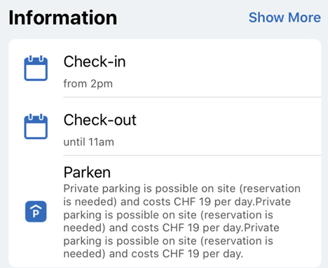
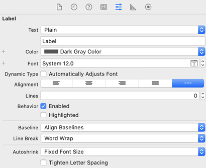

This article is part 6 of my UIKit Cheatsheet series. It deals with adaptive view heights.

===

Often the height of a view - e.g. a label - is not known because it depends on the device dimensions, font size or external data.

Adaptive heights can be set in storyboard by settings lines to 0, linebreak and autoshrink mode:

