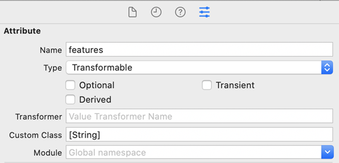

This blog post describes how JSON objects can be stored, serialized and deserialized using CoreData.

===

CoreData offers the possibility to store entries of type "Transformable":



This is pretty convenient to store custom classes or even JSON data that comes e.g. from an API call.
This entry can be stored as NSDictionary, serialized and deserialized as follows:

```
public final class MyCoreDataEntry {

@NSManaged public internal(set) var values: NSDictionary

…

public func decodeValuePairs() -> [ValuePair] {
        let valuePairs: [ValuePair] = features.compactMap { element in
            guard let value = element.key as? String, !value.isEmpty, let enabled = element.value as? Bool else {
                return nil
            }
            
            return ValuePair(key: value, enabled: enabled)
        }
        
        return valuePairs
    }

public struct ValuePair: Equatable {
    public let key: String
    public let enabled: Bool
    
    public static func == (lhs: ValuePair, rhs: ValuePair) -> Bool {
        return lhs.key == rhs.key && lhs.enabled == rhs.enabled
    }
}
}
```

